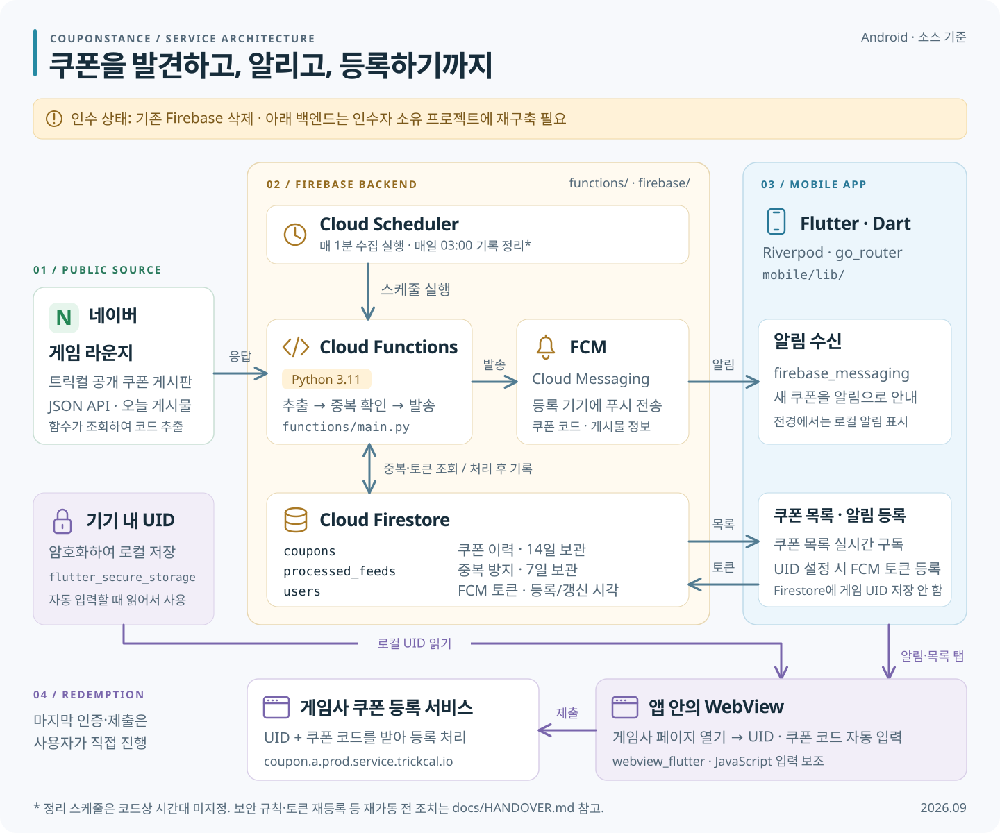

# 쿠폰스탕스

[](./LICENSE)
[](#-기술-스택)
[](#-기술-스택)
[](#-기술-스택)

모바일 게임 '트릭컬 리바이브'의 쿠폰 배포를 실시간 모니터링하여, 새로운 쿠폰이 등록되면 즉시 푸시 알림을 받고 원클릭으로 쿠폰을 등록할 수 있는 편의성 모바일 앱.

## 주요 기능

- **실시간 푸시 알림**: 새 쿠폰 등록 시 즉시 푸시 알림 수신
- **원클릭 쿠폰 등록**: UID와 쿠폰 번호 자동 입력으로 간편하게 쿠폰 등록
- **안전한 UID 관리**: 암호화된 로컬 저장소에 게임 ID 안전하게 보관
- **자동 모니터링**: Cloud Functions가 매 분마다 새 쿠폰 확인

## 서비스 아키텍처



> **인수 시점의 상태:** 기존 Firebase 프로젝트는 삭제되었으며, 그림은 현재 소스에 정의된 구조를 설명합니다. 인수자가 새 Firebase를 구축하고 앱 연결과 필수 수정사항을 반영해야 합니다. 재구축 절차와 알려진 문제는 [인수인계 문서](docs/HANDOVER.md)를 참고하세요.

- **수집·알림:** Scheduler → Python Functions → 네이버 공개 게시물 조회 → Firestore 중복·토큰 조회 → FCM 발송 → 처리 이력 저장.
- **앱 데이터:** Flutter 앱이 Firestore의 쿠폰 목록을 구독하며, UID 설정 과정에서 FCM 토큰을 등록합니다. 게임 UID는 기기의 암호화 저장소에 보관하고 Firestore에는 저장하지 않습니다.
- **쿠폰 등록:** 알림이나 목록을 누르면 앱의 WebView가 게임사 페이지에 UID와 쿠폰 코드를 자동 입력합니다. 사용자가 인증·제출을 완료하며 실제 등록은 게임사 서비스가 처리합니다.

[SVG 원본 보기](docs/assets/architecture.svg) · 이미지의 텍스트·도형은 외부 이미지나 폰트 다운로드 없이 편집할 수 있습니다.

## 기술 스택

### 모바일 프론트엔드

| 구분            | 기술                   | 버전  |
| :-------------- | :--------------------- | :---- |
| **프레임워크**  | Flutter                | 3.9+  |
| **언어**        | Dart                   | 3.9+  |
| **아키텍처**    | Clean Architecture     | -     |
| **상태 관리**   | Riverpod               | 2.6+  |
| **내비게이션**  | GoRouter               | 14.6+ |
| **보안 저장소** | flutter_secure_storage | 9.2+  |
| **웹뷰**        | webview_flutter        | 4.10+ |
| **푸시 알림**   | firebase_messaging     | 15.1+ |

### 백엔드 (서버리스)

| 구분             | 기술                           | 버전  |
| :--------------- | :----------------------------- | :---- |
| **언어**         | Python                         | 3.11+ |
| **플랫폼**       | Firebase Cloud Functions       | -     |
| **데이터베이스** | Cloud Firestore                | -     |
| **스케줄러**     | Cloud Scheduler                | -     |
| **알림 서비스**  | Firebase Cloud Messaging (FCM) | -     |
| **라이브러리**   | requests, beautifulsoup4       | -     |

## 프로젝트 구조

```
trickal_coupon/
├── mobile/                     # Flutter 모바일 앱
│   ├── lib/
│   │   ├── core/              # 핵심 유틸리티 (라우터, FCM, 테마)
│   │   ├── data/              # 데이터 레이어 (저장소, 모델)
│   │   ├── domain/            # 도메인 레이어 (엔티티, 유스케이스)
│   │   ├── presentation/      # UI 레이어 (페이지, 프로바이더, 위젯)
│   │   └── main.dart          # 앱 진입점
│   └── pubspec.yaml
├── functions/                  # Firebase Cloud Functions
│   ├── main.py                # firebase.json source 기준 배포 진입점
│   ├── src/
│   │   ├── scraper/           # 쿠폰 스크래핑 모듈
│   │   ├── services/          # Firestore 및 알림 서비스
│   │   └── main.py            # 별도 수정본 (배포 진입점과 기능 차이 있음)
│   ├── tests/                 # 단위 테스트
│   └── requirements.txt
├── firebase/                   # Firebase 설정
│   ├── firestore.rules        # Firestore 보안 규칙
│   └── firestore.indexes.json # Firestore 인덱스
└── firebase.json
```

## 시작

### 사전 요구사항

- Flutter SDK 3.9+
- Python 3.11+
- Firebase CLI
- Android Studio 또는 Xcode

### 설치 및 설정

#### 1. 저장소 클론

```bash
git clone https://github.com/yourusername/trickal-coupon-notifier.git
cd trickal-coupon-notifier
```

#### 2. Firebase 설정

```bash
# Firebase CLI 설치
npm install -g firebase-tools

# Firebase 로그인
firebase login

# Firebase 프로젝트 초기화
firebase init
```

#### 3. 백엔드 설정 (Cloud Functions)

```bash
cd functions

# 가상 환경 생성
python -m venv venv

# 가상 환경 활성화
# Windows:
venv\Scripts\activate
# Mac/Linux:
source venv/bin/activate

# 의존성 설치
pip install -r requirements.txt
```

#### 4. 모바일 앱 설정

```bash
cd mobile

# Flutter 의존성 설치
flutter pub get

# Flutter용 Firebase 구성
flutterfire configure
```

#### 5. Android 앱 서명 설정 (릴리즈 빌드 필수)

릴리즈 APK를 빌드하려면 서명 키를 생성해야 합니다:

```bash
# 키스토어 파일 생성 (한 번만 실행)
keytool -genkey -v -keystore ~/upload-keystore.jks -keyalg RSA -keysize 2048 -validity 10000 -alias upload

# Windows의 경우:
keytool -genkey -v -keystore C:\Users\<사용자명>\upload-keystore.jks -keyalg RSA -keysize 2048 -validity 10000 -alias upload
```

`mobile/android/key.properties` 파일 생성:

```properties
storePassword=<이전 단계에서 입력한 비밀번호>
keyPassword=<이전 단계에서 입력한 비밀번호>
keyAlias=upload
storeFile=<키스토어 파일 경로, 예: /Users/<사용자명>/upload-keystore.jks>
```

> **중요**: `key.properties` 파일과 키스토어 파일을 절대 버전 관리에 커밋하지 마세요. `.gitignore`에 추가하세요.

### 로컬에서 실행하기

#### 백엔드 함수 로컬 테스트

```bash
cd functions

# 가상 환경 활성화
venv\Scripts\activate  # Windows
source venv/bin/activate  # Mac/Linux

# 스크래퍼 직접 실행
python src/main.py

# 특정 날짜로 테스트
python -c "from src.scraper.coupon_scraper import CouponScraper; s = CouponScraper(); print(s.scrape_today_coupons(target_date='20251016'))"

# 단위 테스트 실행
pytest tests/ -v
```

#### Flutter 앱 실행

```bash
cd mobile

# 연결된 디바이스에서 실행
flutter run

# 특정 디바이스에서 실행
flutter run -d chrome        # 웹
flutter run -d android       # Android 에뮬레이터/디바이스
flutter run -d ios           # iOS 시뮬레이터/디바이스
```

#### 릴리스 APK 빌드

빌드하기 전에 **Android 앱 서명 설정** (5단계)을 완료했는지 확인하세요.

```bash
cd mobile

# APK 빌드 (모든 아키텍처 포함, 파일 크기 큼)
flutter build apk --release

# Split APK 빌드 (아키텍처별 분리, 파일 크기 작음 - 권장)
flutter build apk --split-per-abi --release

# App Bundle 빌드 (Play Store용 - 권장)
flutter build appbundle --release

# 난독화 포함 빌드 (프로덕션용)
flutter build appbundle --obfuscate --split-debug-info=./debug-info
```

**빌드 결과물 위치**:

- APK: `mobile/build/app/outputs/flutter-apk/app-release.apk`
- Split APK: `mobile/build/app/outputs/flutter-apk/app-{arm64-v8a,armeabi-v7a,x86_64}-release.apk`
- App Bundle: `mobile/build/app/outputs/bundle/release/app-release.aab`

## 배포

### Cloud Functions 배포

```bash
# 모든 함수 배포
firebase deploy

# 함수만 배포
firebase deploy --only functions

# 특정 함수만 배포
firebase deploy --only functions:scheduled_coupon_scraper
```

### Firestore 규칙 및 인덱스 배포

```bash
# Firestore 보안 규칙 배포
firebase deploy --only firestore:rules

# Firestore 인덱스 배포
firebase deploy --only firestore:indexes
```

### 로그 확인

```bash
# 실시간 로그 스트리밍
firebase functions:log --only scheduled_coupon_scraper

# 모든 함수 로그 보기
firebase functions:log
```

## 동작 원리

### 백엔드 플로우

1. **Cloud Scheduler**가 매 1분마다 `scheduled_coupon_scraper` 실행
2. **CouponScraper**가 네이버 게임 라운지 JSON API에서 오늘의 게시물 조회
3. 정규식 패턴을 사용하여 게시물 내용에서 쿠폰 코드 추출
4. **FirestoreService**가 중복 게시물 확인하여 재처리 방지
5. `users` 컬렉션에서 등록된 모든 FCM 토큰 조회
6. **NotificationService**가 쿠폰 데이터와 함께 멀티캐스트 푸시 알림 전송
7. 처리된 게시물과 쿠폰 히스토리를 Firestore에 저장

### 모바일 앱 플로우

1. 사용자가 앱을 열고 게임 UID 입력
2. 앱이 Firestore `users` 컬렉션에 FCM 토큰 등록
3. 알림이 도착하면 사용자가 탭하여 웹뷰 열기
4. JavaScript 주입으로 UID와 쿠폰 코드 자동 입력
5. 사용자가 reCAPTCHA를 완료하고 제출하여 쿠폰 등록

## Firestore 컬렉션

### `users`

문서 ID는 FCM 토큰의 해시값으로 생성합니다. 게임 UID는 이 컬렉션에 저장하지 않습니다.

```
{
  "fcm_token": String,      // FCM 디바이스 토큰
  "created_at": Timestamp,
  "updated_at": Timestamp  // 선택 필드: 토큰 갱신 시 기록
}
```

### `processed_feeds`

```
Document ID: {YYYYMMDD}_{feedId}
{
  "feed_id": Number,
  "coupon_code": String,
  "title": String,
  "processed_at": Timestamp,
  "date": String            // YYYYMMDD
}
```

### `coupons`

```
Document ID: {feedId}
{
  "feed_id": Number,
  "coupon_code": String,
  "title": String,
  "created_date": String,   // API에서 받은 원본 타임스탬프
  "discovered_at": Timestamp
}
```

## 테스트

### 백엔드 테스트

```bash
cd functions

# 모든 테스트 실행
pytest tests/ -v

# 커버리지 포함 실행
pytest tests/ --cov=src

# 특정 날짜 스크래핑 테스트
python -c "from src.scraper.coupon_scraper import CouponScraper; s = CouponScraper(); print(s.scrape_today_coupons(target_date='20251016'))"
```

### 수동 HTTP 엔드포인트 테스트

배포 후 HTTP 엔드포인트 테스트:

```bash
# 오늘의 쿠폰 스크래핑
curl https://REGION-PROJECT_ID.cloudfunctions.net/manual_coupon_scraper

# 특정 날짜로 테스트
curl "https://REGION-PROJECT_ID.cloudfunctions.net/manual_coupon_scraper?target_date=20251016"
curl "https://manual-coupon-scraper-h4xaj7vgjq-uc.a.run.app?target_date=20251013"

# 테스트 알림 전송
curl "https://REGION-PROJECT_ID.cloudfunctions.net/manual_coupon_scraper?test=true"
```

### Flutter 테스트

```bash
cd mobile

# 위젯 테스트 실행
flutter test

# 커버리지 포함 실행
flutter test --coverage

# 정적 분석
flutter analyze

# 코드 포맷팅
dart format lib/
```

## 보안

- 사용자 UID는 하드웨어 기반 암호화가 적용된 `flutter_secure_storage`를 사용하여 저장
- Firestore 보안 규칙으로 인증된 사용자만 접근 제한
- API 키나 비밀 정보는 버전 관리에 포함되지 않음
- FCM 토큰은 자동으로 관리 및 갱신됨

## 라이선스

이 프로젝트는 MIT 라이선스를 따릅니다. 자세한 내용은 `LICENSE` 파일을 참조하세요.

## 면책 조항

**이 앱은 '트릭컬 리바이브' 공식 애플리케이션이 아니며, 제작사와 무관합니다.** 플레이어 편의를 위해 제작된 비영리 팬 프로젝트입니다.

---
